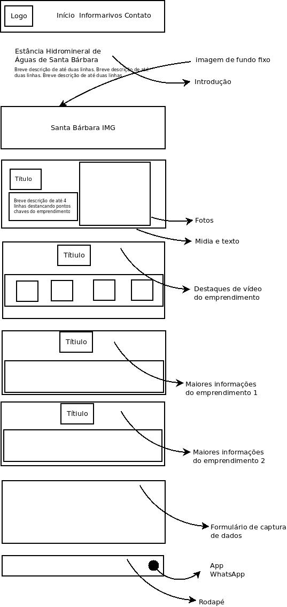

# VivaAVidaNoCampo
Projeto Integrador em Computação I-PJI110-0024 - semestre 4 - UNIVESP

### Nota importante
Este projeto esta em desenvolvimento.

### Estas são as tecnologias usadas no projeto:

1. [Composer](https://getcomposer.org/)
2. [GRUNT](https://gruntjs.com/)
3. [Node.js](https://nodejs.org/en/)
4. [PHP_CodeSniffer](https://github.com/squizlabs/PHP_CodeSniffer)
5. [PHPUnit](https://phpunit.de/)
6. [PostCSS](https://postcss.org/)
7. [TGM Plugin Activation](http://tgmpluginactivation.com/)
8. [WordPress](https://wordpress.org/)
9. [Postgresql](https://www.postgresql.org)

### Template do projeto
[Go](https://wordpress.org/themes/go/) Version: 1.4.4

### Termos de licença do Wordpress
This theme, like WordPress, is licensed under the GPL. Use it to make something cool, have fun, and share what you've learned with others.

This program is free software: you can redistribute it and/or modify it under the terms of the GNU General Public License as published by the Free Software Foundation, either version 2 of the License, or (at your option) any later version.

This program is distributed in the hope that it will be useful, but WITHOUT ANY WARRANTY; without even the implied warranty of MERCHANTABILITY or FITNESS FOR A PARTICULAR PURPOSE. See the GNU General Public License for more details.

## Protótipo do projeto
Este é o protótipo principal da Landing page, do projeto proposto.

